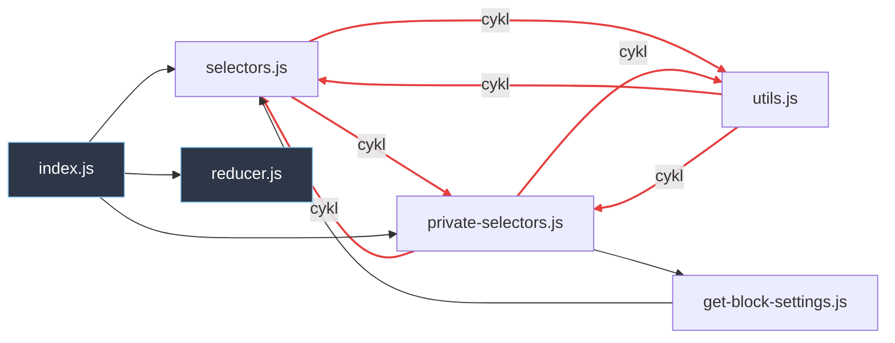

# Artifact 2 — Struktura i zależności (analiza dependency-cruiser)

> Analiza strukturalna monorepo Gutenberg narzędziem **dependency-cruiser v17.4.3**.
> Skupiona na obszarach aktywnych z [`artifact-1-territory.md`](./artifact-1-territory.md).
> **Config:** `.dependency-cruiser.cjs` (reguły warstw + higieny).
> **Zakres:** pakiety `@wordpress/*` w `packages/`, bez Graphviz/DOT.

---

## Konfiguracja narzędzia

- `dependency-cruiser@^17.4.3` zainstalowany jako devDependency (instalacja z `--ignore-scripts`
  z powodu blokady `EPERM` na `node_modules\.bin\*.ps1` na Windows — antywirus/proces trzymał plik).
- `.dependency-cruiser.cjs` zawiera dwie grupy reguł:
  1. **Architektura warstw** — `block-editor` → `editor` → `edit-post`/`edit-site`; niższe nie importują wyższych; `block-editor` agnostyczny względem `core-data`/REST.
  2. **Higiena** — `no-circular`, `no-orphans`, `no-prod-dep-on-dev`, `no-test-imports-in-prod`, brak deps spoza package.json.
- **npm scripts: NIE dodane** (świadomie wstrzymane).

> ⚠️ **Ograniczenie metodologiczne:** depcruise nie resolwuje importów `@wordpress/*` do
> `packages/*/src` (workspace bez symlinków/buildu w `node_modules` → `resolved=@wordpress/x, type=unknown`).
> Reguły warstw oparte na `to.path: '^packages/editor/'` **nie wyłapią** importów cross-package.
> Analizę granic warstw wykonano po polu `module` (specyfikator importu), nie po `resolved`.
> **Rekomendacja:** dodać do reguł warianty `to.path: '@wordpress/editor'` lub skonfigurować aliasy workspace, by działały w CI.

---

## 1. Cykle zależności w obszarach aktywnych

Przeskanowano 6 obszarów: **390 krawędzi cyklicznych**, **202 unikalne moduły**.

| Obszar | Krawędzie cykliczne | Charakter |
|--------|--------------------:|-----------|
| `block-editor/components` | 172 | Epicentrum — m.in. łańcuch **17-modułowy** (list-view → inserter → block-patterns → block-preview → block-list → inner-blocks → layouts → components/index → block-navigation → list-view) |
| `core-data` | 96 | `selectors ↔ private-selectors`, `types.ts ↔ utils/crdt-user-selections` |
| `editor/components` | 31 | Cykl przez nowy kod DataViews-w-editorze: `editor/store → editor/dataviews/store → editor/dataviews/fields/content-preview → editor/components/provider` |
| `block-editor/hooks` | 23 | Gwiazda wokół `typography` (font-family/font-size/text-align → typography) |
| `dataviews/components` | 16 | Lokalne, barrel ↔ child w `dataform-layouts` |
| `edit-site/components` | 11 | Nawigacja boczna (`screen-main ↔ screen-global-styles/identity`) |
| `block-editor/store` | 8 | **Trójkąt `selectors ↔ private-selectors ↔ utils`** (patrz §4) |
| `sync` | **0** | ✅ Czysty — wzorzec do naśladowania |

**Antywzorzec powtarzalny:** `selectors ↔ private-selectors` występuje i w `core-data`, i w `block-editor/store` — prawdopodobnie konsekwencja wzorca prywatnych API WP. Do rozstrzygnięcia: świadomy wzorzec (→ wyjątek w configu) czy dług (→ refaktor).

**Jedyny cross-package cykl** w całym skanie: React Native (`aztec ↔ bridge`) — poza zakresem aktywnych obszarów.

---

## 2. Granice warstw edytora

**Architektura respektowana w 100% — zero naruszeń w górę.** Wszystkie zależności płyną w dół.

| Granica | Wynik | Dowód |
|---------|-------|-------|
| block-editor → editor | ✅ respektowana | 0 importów; block-editor importuje 34 pakiety @wordpress/*, żaden z wyższych warstw |
| block-editor → core-data | ✅ respektowana | Brak `@wordpress/core-data` w importach |
| block-editor → REST/api-fetch | ✅ respektowana | Brak `@wordpress/api-fetch` |
| editor → edit-site/edit-post | ✅ respektowana | 0 importów w górę |
| edit-site ↔ edit-post | ✅ respektowana | 0 krawędzi cross-screen |
| dataviews → core-data/editor/api-fetch | ✅ czysty | 0 importów |

**Sprzężenie `block-editor/components ↔ editor/components` (46 co-change z mapy) = czysta współzmiana, NIE przeciek.**
Kierunek jednoznaczny: **0** importów block-editor → editor; **85** plików `editor/components` zależy od `@wordpress/block-editor`. Editor konsumuje block-editor (w dół), stąd wspólne commity.

**Obserwacja:** block-editor importuje `@wordpress/dataviews` — dataviews traktowany jako warstwa niska (fundament), nie feature. Legalne, ale łączy dwa hotspoty (#1 i #4).

**Realne ryzyko legacy:** nie łamanie warstw, lecz **gęstość legalnych zależności w dół do core-data** (~180 importów z warstw wyższych) i krawędź block-editor → dataviews.

---

## 3. Ryzyka testowalności

Sygnały trudnej izolacji skrzyżowane z istniejącym pokryciem testami.

| Obszar | śr. fan-out | max | % używa `@wordpress/data` | importy core-data | private-apis | testy jedn. |
|--------|-----------:|----:|-----:|----:|----:|----:|
| editor/components | 6.2 | 89 | **66%** | **95** | 77 | 42 |
| edit-site/components | **7.3** | 31 | 55% | 54 | 56 | **0** |
| block-editor/components | 5.2 | **111** | 36% | 0 | 70 | 106 |
| dataviews/components | 6.2 | 21 | 6% | 0 | 20 | **1** |
| core-data | 3.4 | 28 | 14% | 0 | 9 | 46 |
| block-editor/store | 5.2 | 12 | 33% | 0 | 5 | **0** |
| sync | **1.9** | 6 | **0%** | 0 | 3 | 6 |

**Kluczowe ryzyka:**
- **Barrele**: `block-editor/components/index.js` (111 re-eksportów) i `editor/components/index.js` (88) — import jednego komponentu ściąga cały pakiet → mockowanie całego `@wordpress/block-editor`.
- **Potrójny sygnał (data + core-data + private-apis)** = najtrudniejsze do izolacji → **test integracyjny**: `editor/components/provider` (28), `use-block-editor-settings` (18), `visual-editor` (17), `edit-site/components/editor` (31), `page-templates` (20).
- **`edit-site/components`**: najwyższy fan-out + **0 testów jedn.** → zespół de facto wybrał **E2E** (186 specs w `test/e2e/specs/editor`). Nie walczyć z tym.
- **`block-editor/store`**: 0 testów + trójkąt cykliczny → test **na poziomie store** (akcja→stan), nie selektora solo.
- **`dataviews/components`** (1 test/89 modułów, 6% data) = **najlepszy ROI** na dociążenie testami jednostkowymi.
- **`sync`** (fan-out 1.9, 0% data) = wzorzec testowalności.

---

## 4. Diagram: cykl w `packages/block-editor/src/store`

Wybrany, bo łączy trzy sygnały: cykl (§1), zero testów jednostkowych (§3) i hotspoty historii
(`reducer.js` #6, `private-selectors.js` #7 w [artifact-1](./artifact-1-territory.md)).



### Komentarz decyzyjny

**Co tworzy pętlę:** rdzeniem jest **trójkąt `selectors.js ↔ private-selectors.js ↔ utils.js`** —
wszystkie trzy importują się nawzajem (6 wzajemnych krawędzi: B↔C, B↔E, C↔E). `get-block-settings.js`
domyka czwartą ścieżkę (`private-selectors → get-block-settings → selectors`). Żadnego z tych plików
nie da się zaimportować bez wciągnięcia pozostałych dwóch.

**Pierwszy krok rozcięcia:** wyodrębnić z `utils.js` czyste funkcje (operacje na blokach/tablicach,
które nie potrzebują stanu) do nowego, **bez-zależnościowego** modułu (np. `store/pure-utils.js`),
z którego importują zarówno `selectors`, jak i `private-selectors`. To usuwa krawędzie `E→B` i `E→C`
(utils przestaje zależeć od selektorów), zostawiając jednokierunkowe `selectors/private-selectors → pure-utils`.
Trójkąt staje się drzewem — a `block-editor/store` (0 testów jednostkowych) zyskuje testowalny,
izolowany moduł na start pokrycia.

**Dlaczego ten obszar pierwszy:** mały (12 modułów, 8 krawędzi cyklicznych) → szybki refaktor;
wysokie ryzyko (hotspot + 0 testów) → wysoki zwrot; rozcięcie odblokowuje pisanie testów jednostkowych
selektorów, których dziś nie da się odizolować.

---

## Co sprawdzić dalej

1. **Powierzchnia mockowania** `editor/components/provider`: ile selektorów/akcji core-data woła (`--focus "provider" -T text`).
2. Czy importy core-data idą do **publicznego API czy `private-selectors`** (kruche).
3. Rozstrzygnąć wzorzec `selectors ↔ private-selectors`: świadomy (→ wyjątek w configu) czy dług.
4. Dodać reguły warstw działające po specyfikatorze `@wordpress/*` (patrz ograniczenie metodologiczne).
5. Dociążyć testami jednostkowymi `dataviews/components` (najlepszy ROI) i `sync` (gorący RTC).
6. Wygenerować `--metrics` (instability/coupling) dla rankingu wrażliwości — bez graphviz.

### Komendy referencyjne (bez graphviz)

```bash
# cykle w obszarze (mermaid wprost do MD)
npx depcruise --config .dependency-cruiser.cjs --include-only "^packages/block-editor/src/store" -T mermaid packages/block-editor/src/store

# metryki coupling/instability
npx depcruise --config .dependency-cruiser.cjs --metrics -T metrics packages/editor packages/edit-site

# blast radius modułu
npx depcruise --config .dependency-cruiser.cjs --reaches "^packages/core-data/src" -T text packages

# baseline znanego długu (CI gate)
npx depcruise-baseline --config .dependency-cruiser.cjs packages
```
