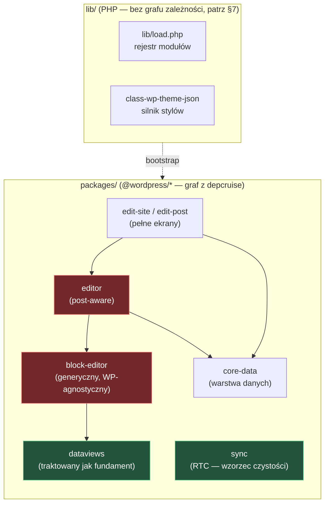

# Repo Map — Gutenberg (onboarding)

> Mapa onboardingowa dla nowego developera. Synteza trzech artefaktów:
> [terytorium (git history)](./artifact-1-territory.md) ·
> [struktura (dependency-cruiser)](./artifact-2-structure.md) ·
> [kontrybutorzy (git authorship)](./artifact-3-contributors.md).
> **Okno:** 12 miesięcy (2025-06-09 → 2026-06-09), 4313 commitów.
> Cel: po 15 min wiesz **gdzie rzeczy żyją**, **co jest niebezpieczne**, **od czego zacząć**.

---

## 1. TL;DR

Gutenberg to monorepo edytora WordPressa: ~kilkadziesiąt pakietów JS (`@wordpress/*`) w `packages/` plus warstwa PHP w `lib/` (bootstrap wtyczki, silnik `theme.json`, kompatybilność z Core). Architektura JS to trzy warstwy edytora: **`block-editor`** (generyczny, WP-agnostyczny) → **`editor`** (świadomy typu posta) → **`edit-site`/`edit-post`** (pełne ekrany); niższe warstwy nie importują wyższych i — co potwierdza graf zależności — **ta granica jest respektowana w 100%**. Praca skupia się w rdzeniu edytora bloków i jego komponentach, a fala feature'ów przesuwała się kwartalnie: DataViews → Collaboration/RTC → Navigation → **Media Editor (bieżący front, Q2'26)**. Boli głównie tam, gdzie historia i graf się nakładają: cykliczny rdzeń `block-editor/store`/`core-data` (selectors ↔ private-selectors), gęste barrele (`index.js` re-eksportujące 111/88 modułów) i obszary z zerowym pokryciem testów jednostkowych przy wysokim fan-oucie. Najgorętszy obszar (Media Editor) ma jednocześnie **najwęższe grono** (2 osoby) — to ryzyko kolizji, nie struktury.

---

## 2. Teren — gdzie żyje system

**Duża odpowiedzialność (głębokie moduły, dotykane stale):**

- **`block-editor/src/components`** (1178 zmian) — rdzeń UI edytora bloków. Najgłębszy: barrel z **111** re-eksportami, max fan-out 111. Jądro repo.
- **`editor/src/components`** (995) — warstwa post-aware. Najdojrzalsza: najsilniejsze sprzężenie z testami w repo.
- **`core-data`** — warstwa danych (resolvery, encje, selektory). Płytszy fan-out (3.4), ale konsumowany przez ~180 importów z góry → zmiana promieniuje szeroko.

**Peryferia / płytkie moduły:**

- **`sync`** (RTC) — fan-out 1.9, **0 cykli**, 0% użycia `@wordpress/data`. Samowystarczalny, wzorzec do naśladowania.
- **`dataviews/components`** — silnie kohezyjny, sprzężenia **tylko wewnątrz pakietu**; zależności wychodzą do zera (czysty względem core-data/editor).

**Aktywność w czasie** (tempo rośnie liniowo: 480 → 1115 → 1233 → 1518 commitów/kwartał):

| Temat | Q3'25 | Q4'25 | Q1'26 | Q2'26 | Status dziś |
|---|---:|---:|---:|---:|---|
| DataViews | 233 | **643** | 535 | 266 | schodzi do utrzymania |
| Collab / RTC | 3 | **291** | 174 | 167 | stabilny |
| Navigation | 22 | 173 | **280** | 129 | po szczycie |
| **Media Editor** | 12 | 24 | 78 | **516** | **bieżący front** |

> **Gdzie struktura ≠ aktywność:** katalog `packages/icons/src/library` ma 1327 dotknięć, a `docs/.../core-blocks.md` — 153, ale to **szum mechaniczny** (bulk-edity ikon / auto-generacja, patrz §3 i §6). Drzewo katalogów sugeruje, że to hotspoty; realnej pracy feature'owej tam nie ma. Odwrotnie: `media-editor` w strukturze wygląda na mały pakiet, a jest dziś najgorętszym frontem.

---

## 3. Realne powiązania — co naprawdę zmienia się razem

Dwa niezależne źródła, **podane wprost przy każdym sprzężeniu**:
**[H]** = historia gita (co-change w commicie), **[G]** = graf importów (depcruise), **[?]** = `unknown` (poza zasięgiem narzędzia).

**Potwierdzone w obu źródłach (najmocniejsze):**

- `block-editor/components` ↔ `block-editor/store` — **[H]** 47 co-change **+ [G]** cykl 172 krawędzi. Zmiana UI prawie zawsze pociąga reducer/selektory.
- `core-data` `selectors ↔ private-selectors` — **[H]** wzorzec **+ [G]** cykl 96 krawędzi. Powtarza się też w `block-editor/store` → antywzorzec systemowy (dług czy intencja — patrz §4/§5).
- `sync/manager.ts ↔ sync/types.ts` — **[H]** 21 **+ [G]** 0 cykli → zdrowa kohezja, nie pętla.

**Rozjazd między źródłami (ważna lekcja):**

- `block-editor/components` ↔ `editor/components` — **[H]** 46 co-change wygląda jak przeciek przez warstwy. **[G] rozstrzyga: to NIE przeciek** — **0** importów w górę, za to **85** plików `editor` zależy od `@wordpress/block-editor`. Editor konsumuje block-editor w dół; wspólne commity to legalna współzmiana, nie naruszenie architektury. *(Historia sama by tu wprowadziła w błąd — graf koryguje.)*

**Coupling przez regenerację / mockowanie — tańszy rodzaj sprzężenia (oznaczone):**

- `docs/.../core-blocks.md` ↔ `block.json` — **[GEN]** plik dokumentacji jest **auto-generowany** z `block.json`. Zmienia się „razem", ale przez `npm run docgen`, nie ręcznie → nie waż tego jak edycji.
- `package-lock.json`, root `package.json` — **[GEN]** lockfile / bumpy wersji. Szum, ignoruj.
- `backport-changelog/*` ↔ `lib/compat/wordpress-*` — **[H]** 45/44 → **rytuał backportu do Core**, półautomatyczny. Sprzężenie procesowe, nie domenowe.

**Cykle (z [G], obszary aktywne — 390 krawędzi, 202 moduły):**

| Obszar | Krawędzie cykliczne | Sedno |
|---|---:|---|
| `block-editor/components` | 172 | łańcuch 17-modułowy (list-view → inserter → … → list-view) |
| `core-data` | 96 | `selectors ↔ private-selectors`, `types ↔ crdt-user-selections` |
| `block-editor/store` | 8 | trójkąt `selectors ↔ private-selectors ↔ utils` (mały, dobry punkt startu refaktoru) |
| `sync` | **0** | wzorzec czystości |

**Wspólne mianowniki PHP (ortogonalne do podziału na pakiety, z [H]):**
`lib/load.php` (85 — rejestr modułów, każdy feature PHP się tu wpina) i `lib/class-wp-theme-json-gutenberg.php` (30 — silnik stylów globalnych). **Uwaga:** ich powiązania z resztą to **[?] unknown** — depcruise objął tylko JS (patrz §7).

---

## 4. Strefy ryzyka

| # | Strefa | Dlaczego ryzyko |
|---|---|---|
| 1 | **`block-editor/store` — trójkąt cykliczny** | `selectors ↔ private-selectors ↔ utils` + **0 testów jednostkowych** + hotspot historii → nic nie zaimportujesz w izolacji. |
| 2 | **Wzorzec `selectors ↔ private-selectors`** (core-data + store) | Powtarza się w dwóch pakietach; nierozstrzygnięte: świadomy wzorzec private-API czy dług. Krucho przy każdej zmianie selektorów. |
| 3 | **Media Editor (`media-editor`)** | Najgorętszy obszar (516 dotknięć Q2) + **grono 2 osób** → najwyższe ryzyko kolizji merge'owej. |
| 4 | **Barrele `index.js`** (block-editor 111, editor 88) | Import jednego komponentu ściąga cały pakiet → testy muszą mockować całe `@wordpress/block-editor`. |
| 5 | **`editor/components/provider` i sąsiedzi** | Potrójny sygnał: `@wordpress/data` + core-data + private-apis → tylko test integracyjny, wysoka powierzchnia mockowania. |
| 6 | **`edit-site/components`** | Najwyższy fan-out (7.3) + **0 testów jednostkowych** → zespół świadomie postawił na E2E (186 specs). Nie walcz z tym, pisz E2E. |

---

## 5. Kogo zapytać (per strefa)

Wszyscy poniżej **aktywni w ostatnich 90 dniach** (ostatni commit w dniach przed 2026-06-09).

| Strefa | Kontakt | Dlaczego on/ona |
|---|---|---|
| 1 + 2 — store / private-selectors | **Daniel Richards** | Owner logiki selektorów/reducera; dominuje po obu stronach wzorca → adresat pytania „dług czy intencja". |
| 2 — higiena store | **George Mamadashvili** | Reducer cleanup, deprecacja akcji `__unstable`, kontrakt akcji. Top warstwy `editor/components` (84). |
| 3 — Media Editor | **Ramon** (owner) + **Andrew Serong** | Ramon = crop/zoom/reducer/a11y, koordynacja **obowiązkowa**. Serong = drugi filar + łącznik cross-area. |
| 4 + 5 — provider / editor barrel | **Adam Silverstein** (lider `provider`) + **Ella / ellatrix** | Silverstein = punkt potrójnego sygnału; Ella = perspektywa architektoniczna private-APIs. |
| 6 — edit-site / E2E | **George Mamadashvili** + **Andrew Serong** | Najwięksi kontrybutorzy warstwy edytora; znają strategię E2E. |
| — DataViews (utrzymanie) | **André / oandregal** + **Nik Tsekouras** | Owner pakietu + drugi filar; adresaci dociążenia testami (najlepszy ROI). |

> **Andrew Serong** przewija się przez strefy 3/5/6 → dobry pierwszy „łącznik", gdy nie wiesz, kogo złapać.

---

## 6. Pierwszy dzień — kolejność czytania (od szerokiego do konkretu)

1. **`gutenberg/AGENTS.md`** — architektura w 1 stronie: warstwy, data layer, system stylów, pitfalls. Zacznij tu.
2. **`lib/load.php`** — centralny rejestr modułów PHP; pokazuje, co wtyczka w ogóle ładuje (mianownik backendu).
3. **`packages/block-editor/README.md`** + **`block-editor/src/components/index.js`** (barrel) — zobacz powierzchnię rdzenia i dlaczego import jest „ciężki".
4. **`packages/block-editor/src/store/`** (`reducer.js`, `selectors.js`, `private-selectors.js`) — najważniejszy cykl i wzorzec, który spotkasz wszędzie (strefy 1–2). Przeczytaj z [diagramem z artifact-2 §4](./artifact-2-structure.md).
5. **`packages/editor/src/components/provider`** — granica warstw i punkt potrójnego sygnału; tu zrozumiesz, jak `editor` konsumuje `block-editor` w dół.
6. **`packages/core-data/src/`** (`entities.js`, `resolvers.js`) — model danych, przez który płynie zapis encji.
7. **`packages/sync/src/`** (`manager.ts`, `types.ts`) — wzorzec czystego, testowalnego modułu (kontrast do strefy 1).
8. **`packages/media-editor/src/image-editor/`** — bieżący front; jeśli zaczynasz od feature'a, prawdopodobnie tu (najpierw pogadaj z Ramonem).

---

## 7. Ograniczenia — czego ta mapa NIE mówi

- **Okno czasowe:** wyłącznie **12 miesięcy** (2025-06-09 → 2026-06-09). Kod starszy, stabilny i nietykany w tym oknie jest **niewidoczny** — niska aktywność ≠ nieważny. To mapa **aktywności i struktury w oknie**, nie kompletny inwentarz.
- **Metoda liczb:** wszystkie liczby to **dotknięcia ścieżek / commity** (proxy aktywności i własności), **nie** linie kodu ani jakość. Dużo commitów ≠ dużo zmian ani ≠ dług.
- **Graf zależności pokrywa tylko JS w `packages/`.** Warstwa **PHP (`lib/`) nie ma grafu** — jej powiązania to **`unknown`, a nie „brak powiązań"**. To samo dotyczy części stacku bez grafu: `theme.json`/JSON Schemas, build, REST API po stronie serwera.
- **Cross-package importy `@wordpress/*` częściowo `unknown`** — depcruise nie resolwował specyfikatorów workspace do `packages/*/src` (brak symlinków/buildu). Granice warstw analizowano po specyfikatorze importu, nie po realnej ścieżce; reguły warstw w configu mogą nie łapać cross-package w CI (rekomendacja: aliasy workspace).
- **Inne języki / stack poza grafem:** jedyny wykryty cross-package cykl to React Native (`aztec ↔ bridge`) — **poza zakresem** analizowanych obszarów aktywnych; RN nie był mapowany.
- **Kontrybutorzy:** boty (`Copilot`, `dependabot`, automatyzacja repo) odfiltrowane; agenci-współautorzy (`Co-authored-by: Claude/Copilot/Cursor`) liczeni pod autorem-człowiekiem. „Owner" = proxy z liczby commitów, nie formalna własność.
- Couplingi oznaczone **[GEN]** (regeneracja/mock) ważą **taniej** niż ręczna edycja — zmiana przez `docgen`/lockfile to nie ten sam koszt co edycja logiki.
